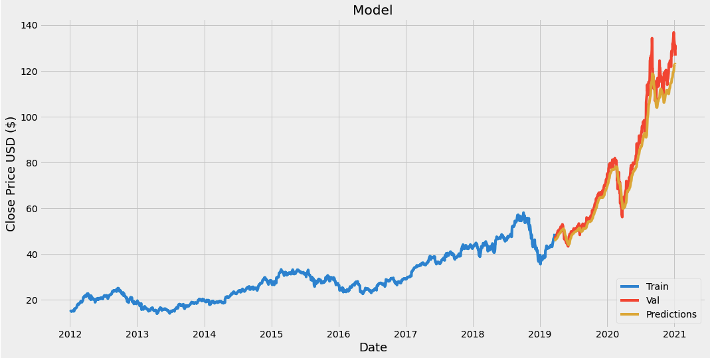

# ApplePredict
This is a machine learning bot that tries to predict closing price of Apple stock for the next day with a root mean squared error of 3.75. The bot is written in Python and the brains behind it is the LSTM recurrent neural network model from the Keras library which does all the heavy lifting involved in the prediction of the price. The previous close price data is scraped from Yahoo Finance using Pandas DataReader. The data is then scaled using the MinMaxScaler from the scikit-learn library. Finally the prediction data is visualized using matplotlib to create a chart.

# Sample Chart
Here is a sample of a prediction, this was for January 7th, 2021. The predicted close price was $122.18 and the actual price was $130.92, so the bot was 93% accurate

